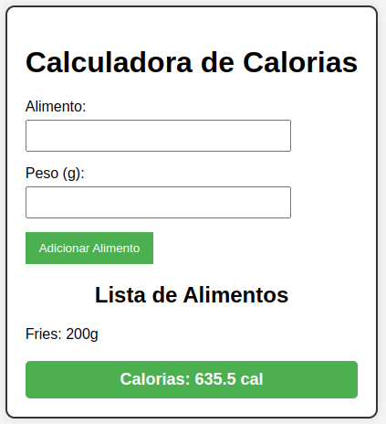

[](https://github.com/pedrohdsouza/c214-app/actions/workflows/actions.yaml)

# Calories Counter App

O projeto consiste em um aplicativo mobile para o cálculo de consumo diário de calorias.

## Conteúdo

- [Projeto Calories Counter App](#calories-counter-app)
  - [Equipe](#equipe)
  - [Pré-requisitos](#pré-requisitos)
  - [Instalação](#instalação)
  - [Framework](#framework)
  - [Utilizando a aplicação](#utilizando-a-aplicação)

## Equipe

- Gabriel Silva Zordan

## Pré-requisitos

Antes de começar, certifique-se de ter o seguinte instalado:

- Python versão 3.10.12 ou acima

## Framework

O projeto foi desenvolvido utilizando o Django, um framework web de alto nível que facilita a construção de aplicações web robustas e escaláveis.

## Instalação

1. Clone este repositório em sua máquina local:

    ```markdown
   git clone 
    ```
2. Entrar no diretório calories_counter dentro de c214-app:

    ```markdown
    cd c214-app/calories_counter
    ```
3. Instalar dependências do projeto:

    ```markdown
    pip install -r requirements.txt
    ```

4. O comando a seguir roda o servidor, gerando um IP local que após encontrado deve ser utilizado em um navegador de sua escolha.

    ```markdown
    python manage.py runserver
    ```

5. O comando a seguir executa os testes do projeto.

    ```markdown
    pytest --html=report.html tests.py
    ```

## Utilizando a aplicação:
A aplicação possui uma interface simples e intuitiva, onde inserimos o nome do alimento em inglês e em seguida o peso em gramas.
 
Conforme adicionamos os alimentos consumidos durante o dia, uma lista de alimentos é criada e atualizada com as informações de entrada, e a soma do valor calorico consumido durante esse dia é mostrada.

### Entradas
Alimento: Fries 

Peso (g): 200

### Resultado
Calorias: 635.5 cal




## Link Apresentação:
